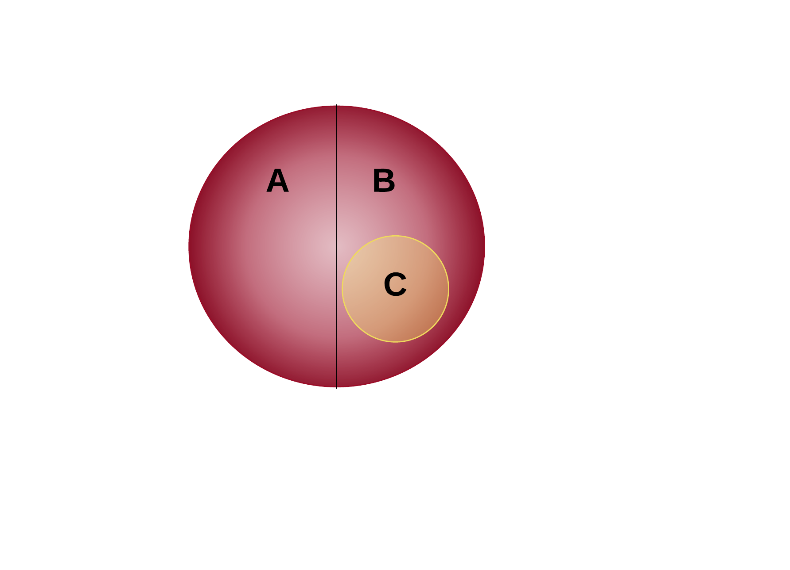
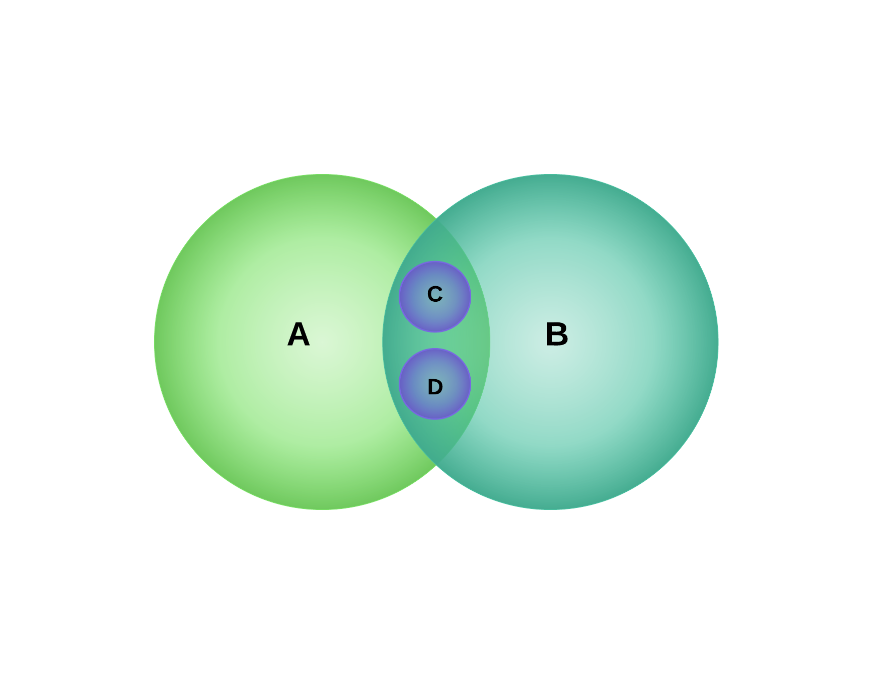
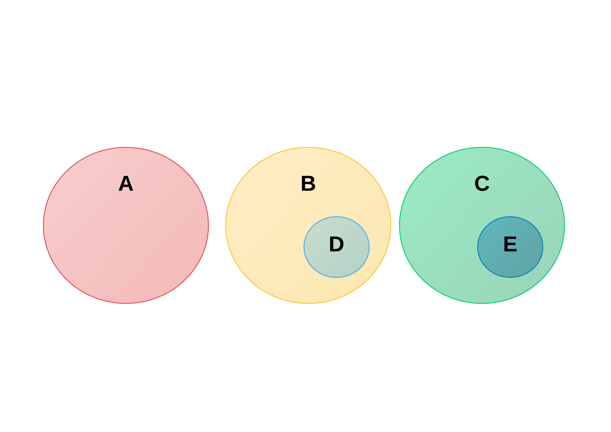
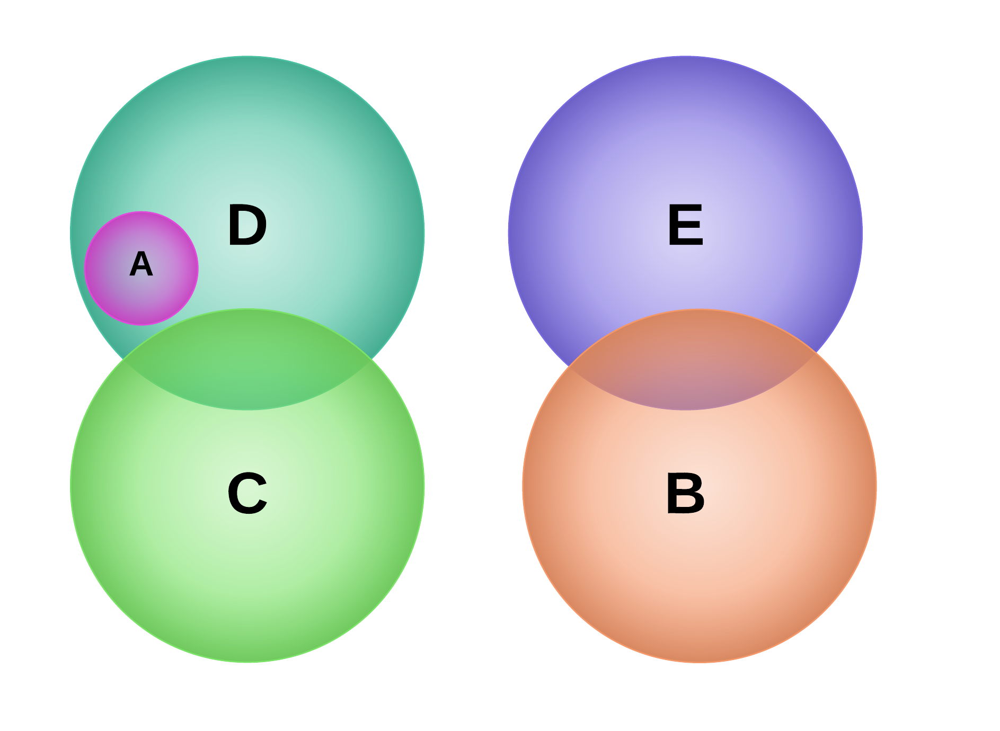
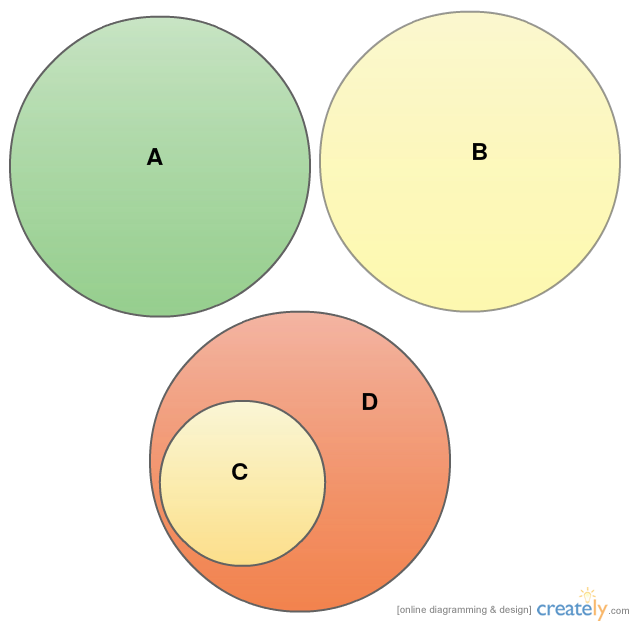

# 1. Graphics

**1.1**

- functional (B) and notional (A) parts of speech are in contradiction
- all verb (C) are notional part of speech (A)

**1.2**

- some words that ends with "ing" (A) are verbs (B), so they intersect
- present participle (C) and gerund (D) are fiorms of verb

**1.3**

- there are  phrases (A), sentences (B), and paragraphs (C)
- All "To be, or not to be--that is the question." (D) are sentences (B)
- All Hamlet's monologue (E) are paragraphs (C)

**1.4**

- There are the letter "a" (B), the word "super" (C), an adjectives (D), and determiners (E)
- some words "super" (C) could be adjectives (D) (not all, "super" can also be noun and adverb)
- some letters "a" (B) could be determiners (E)
- All words "supercalifragilisticexpialidocious" (A) are adjectives (D)

**1.5**
The collection of words is not a sentence. The sentence can not consist of only such collection. The word "home" is a member of a collection that fits definition A.
-  there are a collection of words: "home", "to jump", "sentence", "words" (A) and a sentence (B)
-  The word "home" (C) is a member of a collection that fits definition A.(D)

# 2. Formulas

**2.1**

(B ∧ ¬A) = "bottle" ∨ (C ∧ ¬B) = "bottleneck"

Or, more shortly: (B ∨ C) ∧ ¬A

**2.2**

(A ∧ B) = {"pepper", "toddler"}

(A ∧ B) ∧ ¬C) = {"pepper", "toddler", "bear"}

D ∨ ((B ∧ A) ∧ ¬(C ∧ B)) =  {"pepper", "toddler", "bear", "hereafter"}

**2.3**

(B ∧ ¬A) = "bottle"
(A ∧ (¬B ∧ ¬C)) = "and"
(C ∧ ¬A) = "bottleneck"

All together: (B ∧ ¬A) ∨ (A ∧ (¬B ∧ ¬C)) ∨ (C ∧ ¬A)

**2.4**

The only word we need is "pepper", so:

B ∧ D

# 3. Laws

**3.1** (¬A ∧ B) ∨ (C ∧ A) = X

Law of thought: X → X

| A  |  B  | C  |  ¬A  |  (¬A ∧ B)  |(C ∧ A) |(¬A ∧ B) ∨ (C ∧ A)|X → X|
|----| --- |----| ---  |------------| ------ |------------------| ----|
| +  | +   | +  |  -   |    -       |   +    |      +           |  +  |
| +  | +   | -  |  -   |    -       |   -    |      -           |  +  |
| +  | -   | +  |  -   |    -       |   +    |      +           |  +  | 
| +  | -   | -  |  -   |    -       |   -    |      -           |  +  | 
| -  | +   | +  |  +   |    +       |   -    |      +           |  +  | 
| -  | +   | -  |  +   |    +       |   -    |      +           |  +  | 
| -  | -   | +  |  +   |    -       |   -    |      -           |  +  | 
| -  | -   | -  |  +   |    -       |   -    |      -           |  +  | 

**3.2** (¬(A ⊻ B) ∧ C) = X

Law of thought: X ⊻ ¬X

| A  |  B  | C  |  (A ⊻ B)   |¬(A ⊻ B) | ¬(A ⊻ B) ∧ C |X ⊻ ¬X |
|----| --- |----|------------| ------ |------------------| ----|
| +  | +   | +  |    -       |   +    |      +           |  +  |
| +  | +   | -  |    -       |   +    |      -           |  +  |
| +  | -   | +  |    +       |   -    |      -           |  +  | 
| +  | -   | -  |    +       |   -    |      -           |  +  | 
| -  | +   | +  |    +       |   -    |      -           |  +  | 
| -  | +   | -  |    +       |   -    |      -           |  +  | 
| -  | -   | +  |    -       |   +    |      +           |  +  | 
| -  | -   | -  |    -       |   +    |      -           |  +  | 

**3.3**

((B ∧ A) ⊻ ¬(B ∨ ¬A)) ∨ ¬A

| A  |  B  |  (B ∧ A)   |¬(B ∨ ¬A) |((B ∧ A) ⊻ ¬(B ∨ ¬A))|X ∨ ¬A |
|----| --- |------------| ------ |-----------------------| ------|
| +  | +   |    +       |   -    |      +                |  +    |
| +  | -   |    -       |   +    |      +           	 |  +    |
| -  | +   |    -       |   -    |      -           	 |  +    | 
| -  | -   |    -       |   -    |      -           	 |  +    | 

# The 13th task

- divide all the coins on the table into two sets, 13 coins each
- flip one of the sets
- three results are possible: either we will end up with the same number of heads and tails in both sets, or each set will consist of 13 tails and 0 heads or vice versa.

